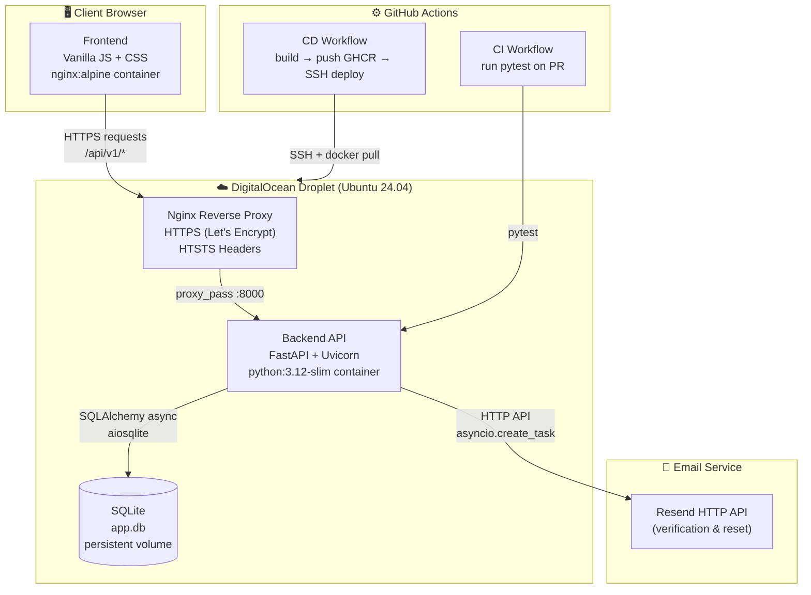
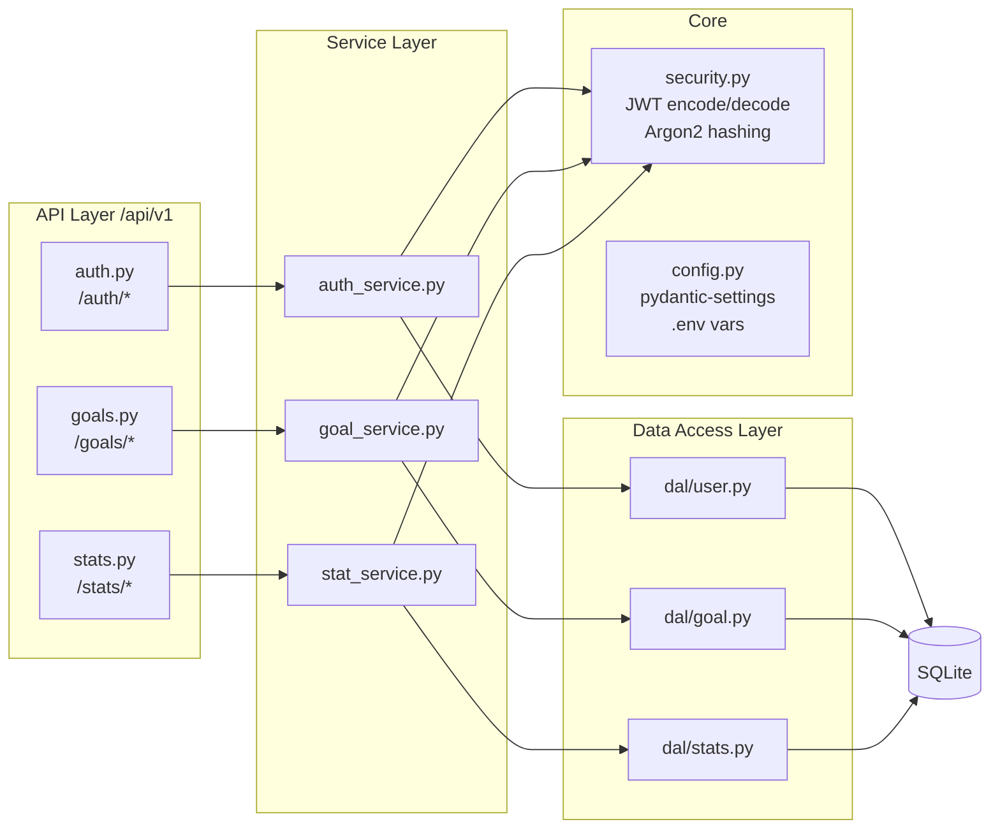
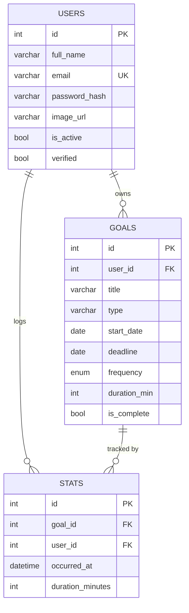
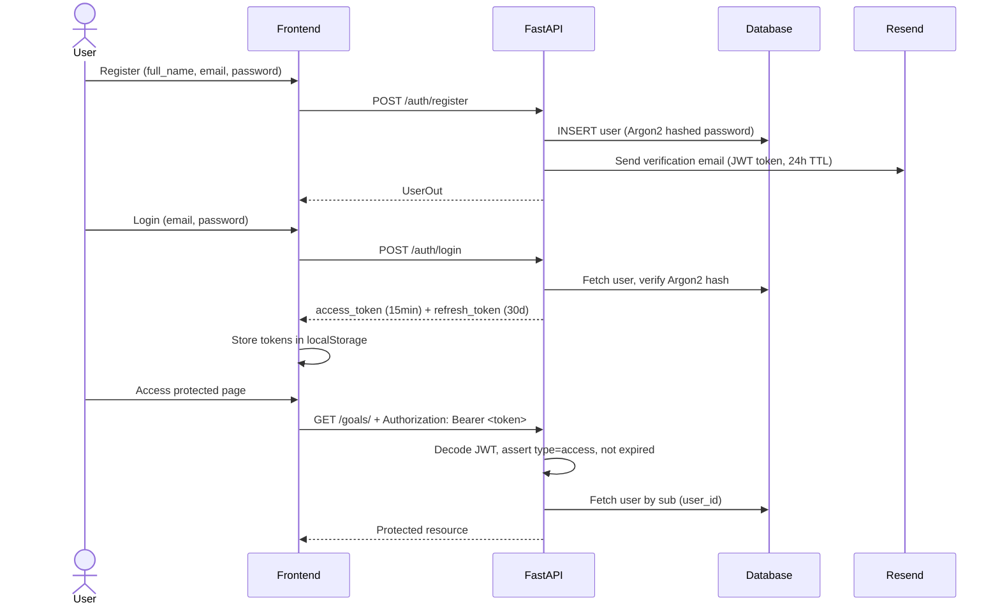
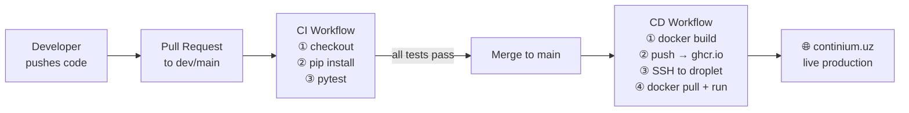
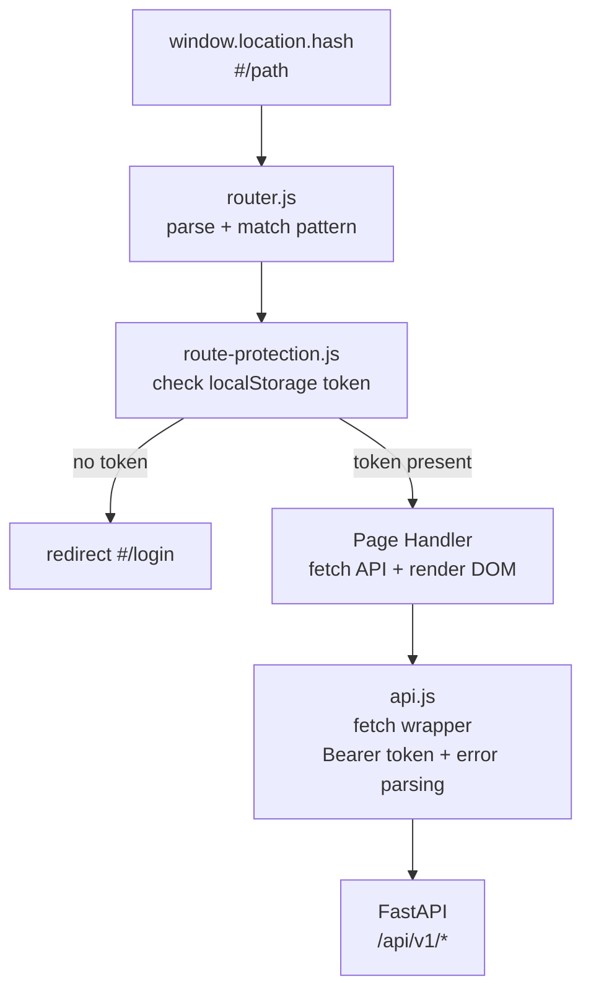

# Continium — System Architecture

## 1. System Overview

---

## 2. Backend Layer Architecture

---

## 3. Database Schema

---

## 4. Authentication Flow

---

## 5. CI/CD Pipeline

---

## 6. Frontend Routing

